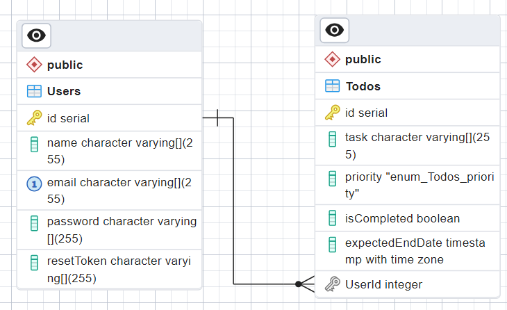

# todo-backend

An Express.js API for handling a user's todo lists

## Prerequisites

To run this API, you will need the following:

* Node.js and npm installed
* PostgreSQL

To test the endpoints:
* [Postman](https://learning.postman.com/docs/introduction/overview/), [Insomnia](https://docs.insomnia.rest/), [curl](https://curl.se/docs/)

## Installation

1. Clone the repository:

```
git clone https://github.com/Meko007/todo-backend.git
```

2. Install the dependencies:

```
npm install
```

3. Create a `.env` file in the root directory of the project and follow the [sample file](./.env.sample)

## Running the API

Run the `npm run dev` script to start the development server.

The API will be available at `http://localhost:XXXX/api/v1`

## ERD (Entity Relationship Diagram)

Designed with pgAdmin



## API Endpoints

### Auth endpoints

| Operation | Route | Description |
|:----------|:------|:------------|
| POST | /auth/refresh-token | Refreshes access token |

### User endpoints

| Operation | Route | Description |
|:----------|:------|:------------|
| POST | /users/register | Registers a new user |
| POST | /users/login | Logs in user |
| POST | /users/logout | Logs out user |
| POST | /users/forgot-password | User forgets password |
| POST | /users/reset-password/:resetToken | User changes password |

### Todo endpoints

| Operation | Route | Auth | Description |
|:----------|:------|:-----|:------------|
| POST | /todos | Required | Creates a new todo |
| GET | /todos | Required | Gets a paginated list of todos |
| GET | /todos/:id | Required | Gets a todo that corresponds with given id |
| PUT | /todos/:id | Required | Updates a todo |
| DELETE | /todos/:id | Required | Deletes a todo |